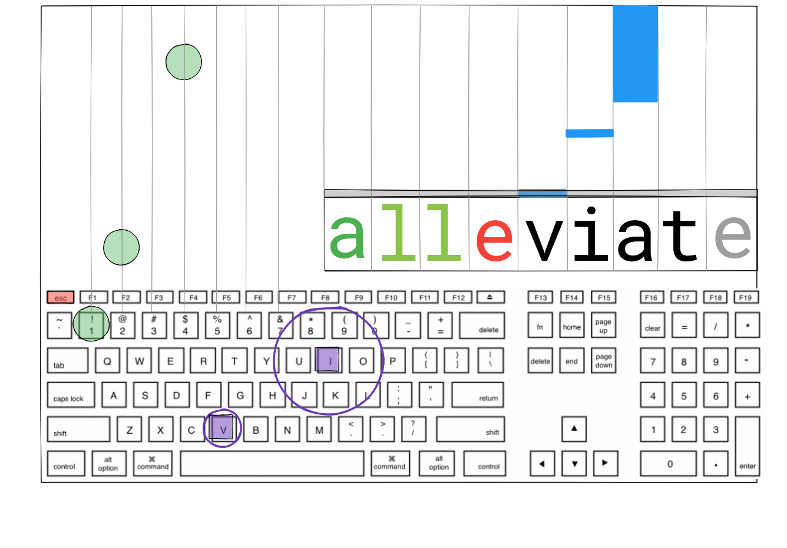

# Rhythm Typer

## Overview
Rhythm Typer is simply a rhythm game with typing game elements, overlapping the goals of each.

In a traditional rhythm game, the beatmap, when confined to a keyboard instead
of a touchscreen, tends to be limited to either the arrow keys or some of the
home row keys and spacebar. It normally makes sense to limit the number of keys
so that the player can focus more on keeping rhythm rather than trying to find the right keys to press.

With a typing game, however, when given a known word, a skilled typist can
quickly mindmap the right keys without much forethought. By using recognized words,
Rhythm Typer makes the case that it can expand the range of possibilities in a
keyboard-based rhythm game by utilizing the skills of a touch typer.

Luckily, there doesn't seem to be an overly-complicated overlap for error
handling between the two genres of games. Both rhythm games and typing games
focus on the accuracy of the keys typed or buttons pressed. Rhythm games merely
use the timing aspect to handle the misses and are typically indifferent to
other buttons pressed, so long as the right ones are pressed.

Typing games typically handle errors either with "full stop" (preventing
progress until the correct key is typed) or "continue" (allowing the player to
move beyond the mistyped letter). The game either will count all subsequent
keystrokes as errors (forcing the player to delete mistakes to rectify them), or
counting future correct keystrokes (allowing to the player to cut their losses with additional points after the typing error).

For a typing game to mesh with a rhythm game, with the all-important element of
a timeline to pressure the player, the "continue" error handling with
forgiveness of future correct keystrokes
seems to be the logical choice, as either the other aforementioned error
handlings would frustrate users after getting a single character wrong while the
game forces them to keep playing. Stopping the music itself would also lead to
choppy gameplay and would be too jarring for rhythm game players.

## MVP Features
These basic features will be provided:
- [ ] Tutorial on how to play
- [ ] Music to choose from
- [ ] Scrolling text pulled from a dictionary
	- [ ] Dictionary keyed by number of characters
- [ ] Visual cues:
	- [ ] Sliding bar with falling rectangles
- [ ] Error handling:
	- [ ] 1st draft: P/NP (green/red) for as large a window as possible
	- [ ] Fail out after 20 misses
- [ ] Score calculation
- [ ] Settings for:
	- [ ] Volume control: music and sound effects
	- [ ] Keystroke feedback sound effect
	- [ ] Difficulty: (speed of visual cues only)

### Upcoming features
- [ ] Number keys as traditional beatmaps (depicted in the wireframe)
- [ ] Full sentences, including capitalization and punctuation

There is also the possibility of using full sentences, as in a traditional
typing game. However, double keystrokes with `shift` must be correctly handled.
- [ ] Custom audio tracks and beatmaps

## Technologies
The following technologies will be used and considered:
*	Vanilla JS for grabbing element values
*	HTML5 canvas for rendering DOM elements
*	React & Redux for menu/settings options panels
*	Babel for browser compatibility
*	Technologies for handling syncing audio with keystrokes and storing the maps
    *   At first I was at a loss in figuring out what technologies to use
        regarding this very crucial piece of technology, until I stumbled upon
        the right Google query and unvealed a wealth of information regarding
        audio timing. I'll have
        to do some more research to decide which technology would be of best use
        for this.

## Wireframes

## Timeline
